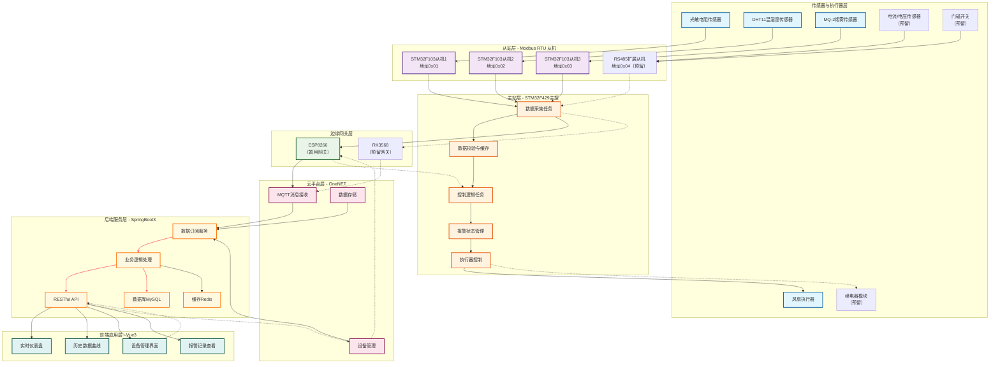

# 基于Modbus 与 MQTT的机柜多源状态监测与远程运维系统

## 1 引言

### 1.1 项目背景
在小型机房、校园网络机柜、社区弱电间等场景中，设备环境和供电安全对网络与信息系统的稳定性至关重要。  
传统机柜缺乏智能化监测和远程运维能力，存在以下问题：

- 环境异常（温度过高、烟雾）未及时处理 → 设备损坏或火灾；
- 电源过载或掉电无监测 → 影响业务连续性；
- 机柜被非法开启 → 存在安全风险；
- 缺乏远程监控，依赖人工巡检，效率低。

### 1.2 项目目标
本项目旨在为小型机房或网络机柜提供智能化守护功能，通过嵌入式主控（STM32F429IGTx）与从机（STM32F103C8T6，并预留通用RS485扩展从机接口）实现多点传感器数据采集、状态监控与本地控制，并将数据通过边缘网关上传至云端平台，实现远程可视化与告警。 

**系统目标**：

- **安全**：实时监控机柜门禁、烟雾、供电、温湿度、光照等状态。
- **稳定**：本地具备独立逻辑，异常时可直接触发多级告警。
- **可扩展**：支持多传感器节点与预留设备接入，云端存储和扩展应用。

## 2 硬件设计

### 2.1 控制层（STM32F429IGTx）
- **核心功能**：系统主控制器，负责任务调度、数据汇聚、逻辑决策与指令下发
- **网络接口**：
  - 与边缘网关通信接口（USART3，用于连接ESP8266）
  - 预留以太网接口（W5500 或板载 PHY）
- **报警模块**：
  - 三色LED指示灯（绿/黄/红）
  - 有源蜂鸣器（支持脉冲与常响模式）

### 2.2 设备层（从机节点）
#### 2.2.1 STM32F103C8T6 从机（3个，独立节点）
- 均通过 Modbus RTU 协议（RS485总线）与主控通讯，地址分别设为**0x01**、**0x02**、**0x03**
- **从机1（地址0x01）**：
  - 挂载设备：光敏电阻模块
  - 功能：采集机柜内部光照强度（范围0-1000lux），支持定时上报（默认100ms/次）与主控主动查询
- **从机2（地址0x02）**：
  - 挂载设备：DHT11温湿度传感器
  - 功能：采集环境温度（0-50℃）与相对湿度（20%-90%RH），支持定时上报（默认500ms/次）与主控主动查询
- **从机3（地址0x03）**：
  - 挂载设备：MQ-2烟雾传感器
  - 功能：采集可燃气体/烟雾浓度（输出电压对应浓度值），支持定时上报（默认200ms/次）与主控主动查询

#### 2.2.2 预留从机：RS485扩展节点
- 通讯预留：通过Modbus RTU协议与主控对接（预留RS485接口与地址**0x04**）
- 预挂载设备：
  - 电流互感器（监测机柜总进线电流）
  - 电压检测模块（监测三相/单相供电电压）
  - 门磁开关（机柜门禁状态检测）
  - 继电器模块（预留电源控制接口）

### 2.3 传感器与执行器明细
| 类型       | 设备型号/规格          | 挂载节点       | 监测/控制对象                |
|------------|-----------------------|----------------|-----------------------------|
| 传感器     | 光敏电阻模块          | STM32F103（0x01）| 机柜内光照强度              |
| 传感器     | DHT11                 | STM32F103（0x02）| 环境温湿度                  |
| 传感器     | MQ-2                  | STM32F103（0x03）| 烟雾/可燃气体浓度           |
| 传感器     | 电流互感器（预留）    | RS485扩展节点（0x04，预留） | 机柜总电流                  |
| 传感器     | 电压检测模块（预留）  | RS485扩展节点（0x04，预留） | 供电电压                    |
| 传感器     | 门磁开关（预留）      | RS485扩展节点（0x04，预留） | 机柜门禁状态                |
| 执行器     | 三色LED指示灯         | 主控STM32F429   | 系统状态指示（绿/黄/红）     |
| 执行器     | 有源蜂鸣器            | 主控STM32F429   | 声音告警（脉冲/常响）       |
| 执行器     | 风扇（PWM控制）       | 主控STM32F429   | 环境降温（联动温度阈值）     |
| 执行器     | 继电器模块（预留）    | RS485扩展节点（0x04，预留） | 电源通断控制                |

### 2.4 边缘网关
#### 2.4.1 暂用网关：ESP8266
- 通信方式：通过UART与主控STM32F429连接，支持AT指令控制
- 功能：将主控汇聚的传感器数据、告警状态通过MQTT协议上传至OneNET云平台
- 网络支持：802.11 b/g/n Wi-Fi（2.4GHz），支持动态IP与静态IP配置

#### 2.4.2 预留网关：RK3568
- 预留接口：通过以太网与主控连接（待扩展）
- 预实现功能：本地数据缓存、边缘计算（复杂逻辑处理）、多协议转换（MQTT/HTTP/CoAP）

## 3 软件功能

### 3.1 主控（STM32F429IGTx）
#### 3.1.1 任务流程
- **数据采集任务**：
  - 作为Modbus RTU主机，定时轮询3个STM32F103从机（周期500ms）
  - 支持预留扩展从机的数据查询接口
  - 数据校验：剔除异常值（超出传感器量程数据），缓存有效数据（最近100条）
- **控制逻辑任务**：
  - 报警状态判断（基于传感器数据与阈值对比）：
    - **状态0**（正常）：所有参数均在阈值范围内 → 绿灯亮，蜂鸣器关闭
    - **状态1**（设备运行警报）：任一参数（温度/湿度/光照/气体浓度）超过标准阈值 → 黄灯亮，蜂鸣器响1秒停1秒
    - **状态2**（设备严重警报）：两个及以上参数超过标准阈值 → 红灯亮，蜂鸣器常响
  - 执行器控制：
    - 温度超阈值 → 启动风扇（PWM占空比随温度动态调整）
    - 严重警报时 → 触发预留继电器断电保护（可选使能）
- **通讯任务**：
  - 与ESP8266交互：封装数据格式（设备ID、时间戳、传感器值、报警状态），通过UART发送
  - 数据上传频率：正常状态30秒/次，报警状态5秒/次

### 3.2 从机（STM32F103C8T6）
- **传感器驱动**：
  - **从机1**：ADC采集光敏电阻电压，转换为光照强度（校准公式：lux = k*V + b，k、b可通过主控配置）
  - **从机2**：DHT11驱动（单总线协议），解析温湿度原始数据
  - **从机3**：ADC采集MQ-2输出电压，转换为气体浓度相对值（0-100%）
- **Modbus RTU从机协议**：
  - 支持功能码：0x03（读取保持寄存器，返回传感器数据）、0x06（写入单个寄存器，配置校准参数）
  - 数据寄存器定义：寄存器0x0000存储当前测量值，0x0001存储设备状态（0-正常，1-故障）

### 3.3 边缘网关（ESP8266）
- **数据转发**：
  - 接收主控数据帧，解析后封装为OneNET平台要求的JSON格式
  - MQTT连接管理：自动重连（断网后10秒/次重试），保持连接心跳（60秒/次）
- **配置功能**：
  - 通过AT指令配置Wi-Fi账号密码、OneNET设备ID、MQTT主题

### 3.4 云端与应用层
#### 3.4.1 云平台（OneNET）
- 数据接入：接收ESP8266上传的MQTT消息，存储原始数据（保留30天）
- 设备管理：支持主控/从机设备在线状态监测、历史数据查询API

#### 3.4.2 后端服务（SpringBoot3）
- **订阅层**：
  - 基于OneNET平台标准SDK，通过数据流转订阅云平台上的数据
- **接口层**：
  - 提供RESTful API：查询实时数据（/api/realtime）、历史数据（/api/history?start=xxx&end=xxx）、报警记录（/api/alarm）
  - 权限控制：基于Token的身份验证（管理员/普通用户）
- **业务层**：
  - 数据处理：从ONE net平台同步数据，转换为前端所需格式
  - 报警规则管理：支持前端配置报警阈值（与主控阈值联动同步）
- **持久层**：
  - 数据库：MySQL（存储用户信息、设备配置、报警记录）
  - 缓存：Redis（缓存实时数据，减轻数据库压力）

#### 3.4.3 前端应用（Vue3）
- **页面组件**：
  - 实时仪表盘：展示各传感器数据（数值+动态图表）、系统报警状态
  - 历史曲线：支持温湿度/光照/气体浓度的时间趋势图（可选择时间范围）
  - 设备管理：显示各从机在线状态、配置传感器阈值
  - 报警记录：列表展示历史报警事件（时间、类型、状态）
- **交互功能**：
  - 数据刷新：实时页面5秒自动刷新，历史页面手动查询
  - 阈值设置：修改后同步至主控STM32F429（通过云端→ESP8266→主控链路）

## 4 技术栈

### 4.1 硬件
- 主控：STM32F429IGTx（核心控制器）
- 从机：STM32F103C8T6（3个，传感器节点）、RS485扩展从机（地址0x04，预留）
- 边缘网关：ESP8266（暂用）、RK3568（预留）
- 显示与交互：三色LED、蜂鸣器
- 传感器：光敏电阻、DHT11、MQ-2、门磁开关（预留）、电流/电压模块（预留）
- 执行器：PWM风扇、继电器（预留）

### 4.2 云端与应用层
- **云平台**：ONE net（数据接收与存储）
- **后端**：
  - 框架：SpringBoot3
  - 数据库：MySQL 8.0
  - 缓存：Redis 6.x
  - 通讯：MQTT客户端（订阅ONE net数据）
- **前端**：
  - 框架：Vue3 + Vite
  - UI组件库：Element Plus
  - 图表库：ECharts（数据可视化）
  - 状态管理：Pinia

## 5 预期成果

- **硬件系统**：
  - 完成主控与3个STM32F103从机的板级设计与调试，传感器数据采集准确
  - 边缘网关ESP8266稳定上传数据至ONE net平台，通信成功率≥99%
  - 报警模块响应正确：根据状态自动切换LED颜色与蜂鸣器模式
- **软件功能**：
  - 主从机Modbus通讯可靠，数据传输延迟≤100ms
  - 后端API接口响应时间≤500ms，前端页面交互流畅
- **系统集成**：
  - 实现从传感器采集→本地处理→云端上传→远程监控的全链路打通
  - 支持通过前端修改阈值参数，且主控能正确同步并生效
  - 预留扩展从机与RK3568的硬件接口与软件适配层，可无缝扩展
- **文档交付**：硬件原理图、嵌入式代码注释、后端API文档、前端操作手册

## 6 报警状态说明

| 状态码 | 名称         | 触发条件                          | 硬件响应                          | 数据上传频率 |
|--------|--------------|-----------------------------------|-----------------------------------|--------------|
| 0      | 正常运行     | 所有监测参数均在阈值范围内        | LED绿灯常亮，蜂鸣器关闭          | 5秒/次      |
| 1      | 设备运行警报 | 任一参数（温度/湿度/光照/气体浓度）超过阈值 | LED黄灯常亮，蜂鸣器响1秒停1秒 | 5秒/次       |
| 2      | 设备严重警报 | 两个及以上参数超过阈值            | LED红灯常亮，蜂鸣器持续鸣叫      | 5秒/次       |

| 状态码 | 名称         | 触发条件                          | 硬件响应                          | 数据上传频率 |
|--------|--------------|-----------------------------------|-----------------------------------|--------------|
| 0      | 正常运行     | 温度正常 (≤27℃) | 风扇停止      | 5秒/次      |
| 1      | 设备运行警报 | 温度超限 (27℃ < T ≤ 35℃) | 风扇中速 60%运行 | 5秒/次       |
| 2      | 设备严重警报 | 温度超限 (T > 35℃) | 风扇高速 90%运行 | 5秒/次       |

## 7 技术流程图（数据与控制流程）

