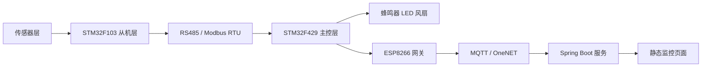
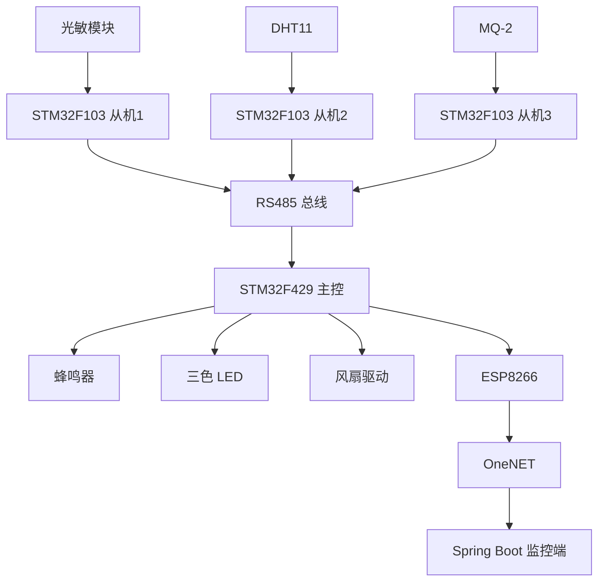
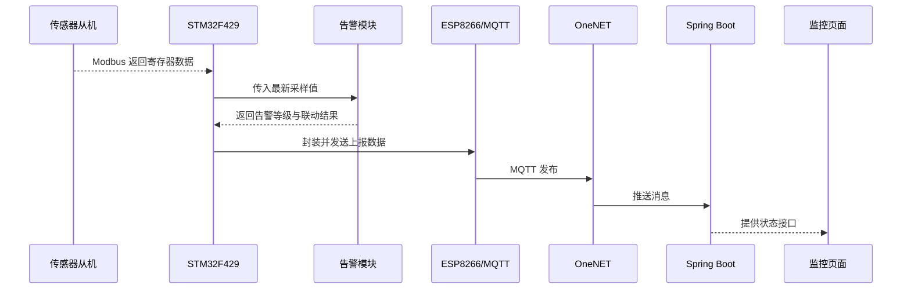

# 第三章 项目框架设计与模块设计

## 3.1 设计目标

本章在第二章需求分析的基础上，对项目的软件与硬件框架进行分层设计，并进一步细化到各子模块的职责、接口、数据流和协作关系。由于仓库中已经存在主控程序、三个 STM32F103 从机工程以及 Spring Boot 后端，因此本章采用“实际代码落点 + 工程化说明”的方式展开，保证文档内容能够直接对应现有实现。

项目设计目标主要包括三点：

1. 构建一个清晰的分层架构，使采集层、控制层、传输层和展示层职责明确。
2. 将不同传感器与协议逻辑拆分为独立模块，便于调试、维护和扩展。
3. 保证系统在断网情况下仍能本地报警，在联网情况下再叠加云端监控与远程运维能力。

## 3.2 总体框架设计

### 3.2.1 分层架构

系统总体上可以拆分为五层：

- 感知层：由光敏电阻、DHT11、MQ-2 等传感器组成，负责采集机柜内部环境信息。
- 采集层：由三个 `STM32F103C8T6` 从机构成，负责驱动传感器并将数据映射到 Modbus 寄存器。
- 控制层：由 `STM32F429` 主控构成，负责 Modbus 主站轮询、数据汇聚、状态判断和执行器联动。
- 传输层：由 `ESP8266 + MQTT + OneNET` 构成，负责将本地数据可靠上传至云平台。
- 应用层：由 `Spring Boot + Web 页面` 构成，负责订阅云端消息、缓存设备状态并向用户展示。

### 3.2.2 总体框架图



### 3.2.3 设计原则

- 高内聚低耦合：每个传感器节点只负责一种主要采集任务，主控负责聚合与决策，后端负责展示和接口输出。
- 接口统一：所有从机统一采用 Modbus RTU 保持寄存器对外提供数据。
- 先本地闭环再远程扩展：即使 Wi-Fi 或云平台异常，本地仍能完成采集与声光告警。
- 易于扩展：为扩展从机、电压电流模块、门磁开关、继电器控制等模块保留地址与接口位置。

## 3.3 硬件框架设计

### 3.3.1 主控硬件框架

主控采用 `STM32F429IGTx`。在当前工程中，其核心硬件职责包括：

- 通过 RS485 接口作为 Modbus 主站轮询三个从机。
- 通过串口连接 ESP8266，完成联网和 MQTT 上报。
- 通过 PWM 或 GPIO 控制 LED、蜂鸣器与风扇。
- 维护本地告警状态，作为系统控制中枢。

### 3.3.2 从机硬件框架

三个从机均采用 `STM32F103C8T6`，各自负责一种传感器：

| 从机地址 | 工程目录 | 采集对象 | 寄存器映射 |
| --- | --- | --- | --- |
| `0x01` | `09-2-F103-photoresistor` | 光敏电阻 | `40001` |
| `0x02` | `09-3-F103-DHT11` | DHT11 温湿度 | `40011`、`40012` |
| `0x03` | `09-4-F103-MQ2` | MQ-2 烟雾浓度 | `40021` |

这种硬件拆分方式具有两个优点：一是每个节点调试简单；二是当某个传感器节点异常时，不会拖垮整个系统。

### 3.3.3 硬件连接示意



## 3.4 软件框架设计

### 3.4.1 主控软件框架

主控工程位于 `09-1-MQTT-Modbus`。从 `User/main.c` 可以看出，其主循环非常明确：

1. 初始化串口、PWM、SysTick、Modbus 主站和报警系统。
2. 初始化 ESP8266 的 Wi-Fi 与 MQTT 连接。
3. 周期性轮询三个从机寄存器。
4. 将轮询结果写入应用数据缓存。
5. 调用报警模块判断等级并控制执行器。
6. 调用 MQTT 周期逻辑完成上报与下行消息处理。

因此主控软件可以划分为以下几个子层：

- 驱动层：串口、PWM、蜂鸣器、电机、SysTick。
- 协议层：RS485、Modbus RTU、MQTT 报文封装。
- 数据层：应用数据管理模块，负责逻辑量与寄存器映射。
- 业务层：告警判断、风扇联动、状态输出。

### 3.4.2 从机软件框架

从机软件统一遵循“传感器驱动 + 寄存器维护 + Modbus 从站”的设计模式：

- 底层驱动负责读取传感器原始数据。
- `application_data_manager` 将采样结果写入指定寄存器。
- `modbus_rtu_link` 与 `usart2_rs485_driver` 负责接收主站请求并按协议返回寄存器值。

这样统一的框架保证了不同类型的传感器虽然驱动不同，但对主站暴露出来的接口形式完全一致。

### 3.4.3 后端软件框架

后端工程位于 `09-5-WebServer/iot-onenet`，当前采用 `Spring Boot 3 + Spring Security + Pulsar Client`。从代码实现来看，后端被划分为：

- 配置层：`config` 包，负责安全、Jackson、OneNET 配置。
- 消费层：`consumer` 与 `auth` 包，负责接入 OneNET 的 Pulsar 消息。
- 业务层：`services` 包，负责状态缓存、操作登记和数据集成。
- 接口层：`controller` 包，负责登录接口与设备状态接口。
- 展示层：`src/main/resources/static`，负责监控页面和登录页面。

## 3.5 模块设计

### 3.5.1 主控模块设计

#### 1. `main.c` 主流程模块

职责：

- 完成全局初始化。
- 组织主循环的执行顺序。
- 串联 Modbus 采集、报警处理和 MQTT 上报。

特点：

- 采用裸机轮询方式，逻辑直观，便于课程项目调试。
- 模块之间关系简单，适合在没有 RTOS 的环境下稳定运行。

#### 2. `modbus_master/modbus_read.c` 主站采集模块

职责：

- 发送对从机 1、2、3 的读寄存器请求。
- 解析从机返回的 RTU 帧。
- 将采集结果写入主控侧应用数据管理模块。

设计要点：

- 从机 1 读取 `40001` 光照值。
- 从机 2 读取 `40011~40012` 温湿度值。
- 从机 3 读取 `40021` 烟雾浓度值。
- 通过 CRC16 确保总线通信可靠。

#### 3. `modbus_master/application_data_manager.c` 数据管理模块

职责：

- 定义逻辑数据 ID 与从机地址、寄存器地址之间的静态映射。
- 缓存最近一次采样数据。
- 向上提供统一读写接口，屏蔽底层寄存器细节。

设计意义：

- 业务层不必直接操作 Modbus 地址。
- 当未来增加扩展从机或更多寄存器时，只需要扩展映射表。

#### 4. `alarm/alarm.c` 告警处理模块

职责：

- 依据温度、湿度、光照和 MQ2 数值判断当前告警等级。
- 控制蜂鸣器模式。
- 配合 LED 和风扇形成本地联动。

当前实现中划分了三个等级：

- 安全：蜂鸣器关闭。
- 警告：蜂鸣器周期性鸣叫。
- 严重：蜂鸣器常响。

该模块是系统“本地闭环”能力的核心，保证即使云端不可用，现场仍能得到响应。

#### 5. `mqtt/bsp_esp8266_mqtt.c` 上云通信模块

职责：

- 负责构建 MQTT CONNECT、SUBSCRIBE、PUBLISH 报文。
- 通过 ESP8266 建立到 OneNET Broker 的连接。
- 执行数据发布与下行消息解析。

设计特点：

- 采用轻量化的手工报文拼装方式，适合 MCU 内存受限场景。
- 与主控主循环耦合较低，便于后续替换为其他网关或协议实现。

### 3.5.2 从机模块设计

#### 1. 光敏从机模块

对应工程：`09-2-F103-photoresistor`

职责：

- 周期性采集光敏电阻 ADC 值。
- 更新保持寄存器 `40001`。
- 作为地址 `0x01` 的 Modbus 从站响应主控查询。

模块组成：

- `photoresistor/bsp_photoresistor.*`：ADC 采样。
- `modbus_slave/*`：从站协议、寄存器管理和 RS485 驱动。

#### 2. DHT11 从机模块

对应工程：`09-3-F103-DHT11`

职责：

- 读取 DHT11 单总线温湿度数据。
- 更新保持寄存器 `40011` 和 `40012`。
- 作为地址 `0x02` 的 Modbus 从站返回采集结果。

模块组成：

- `dht11/bsp_dht11.*`：DHT11 驱动。
- `dwt_delay`、`systick`：高精度时序支持。
- `modbus_slave/*`：从站通信框架。

#### 3. MQ2 从机模块

对应工程：`09-4-F103-MQ2`

职责：

- 采集 MQ-2 模拟量并转换为浓度近似值。
- 更新保持寄存器 `40021`。
- 作为地址 `0x03` 的 Modbus 从站响应查询。

模块组成：

- `mq2/bsp_mq2.*`：MQ-2 采样驱动。
- `modbus_slave/*`：从站协议与寄存器层。

### 3.5.3 后端模块设计

#### 1. `consumer/IoTPulsarConsume.java` 消息消费模块

职责：

- 建立到 OneNET Pulsar 的订阅连接。
- 解密消息中的 `originalMsg`。
- 区分属性上报和 `set_reply` 控制响应。

它是云端数据进入本系统的入口模块。

#### 2. `services/DeviceIntegrationService.java` 数据集成模块

职责：

- 统一承接消费层传入的设备数据。
- 更新设备状态缓存。
- 处理控制指令回执与待处理操作完成逻辑。

该模块起到消费层与业务层之间的桥接作用。

#### 3. `services/DeviceStateService.java` 状态缓存模块

职责：

- 线程安全地保存当前最新设备状态。
- 为接口层提供统一的状态读取能力。

设计特点：

- 使用读写锁控制并发访问。
- 把温度、湿度、光照、MQ2、错误码和 LED 状态封装为统一 DTO。

#### 4. `controller/DeviceApiController.java` 设备接口模块

职责：

- 提供 `/api/status` 实时状态查询接口。
- 提供 `/api/ops/led` 远程控制接口。
- 提供 `/api/health` 健康检查接口。

这部分是监控页面和外部调用方最直接访问的模块。

#### 5. `controller/LoginController.java` 登录模块

职责：

- 提供登录、登录状态检查和退出接口。
- 利用 Session 保存已登录用户状态。

当前实现较轻量，但已经具备基础访问控制能力，适合课程展示。

## 3.6 关键接口设计

### 3.6.1 Modbus 寄存器接口

| 从机地址 | 寄存器 | 含义 | 数据来源 |
| --- | --- | --- | --- |
| `0x01` | `40001` | 光照采样值 | 光敏电阻 ADC |
| `0x02` | `40011` | 温度 | DHT11 |
| `0x02` | `40012` | 湿度 | DHT11 |
| `0x03` | `40021` | 烟雾浓度 | MQ-2 |
| `0x04` | `40031`、`40032` | 预留扩展通道 | 预留扩展 |

### 3.6.2 Web API 接口

| 接口 | 方法 | 功能说明 |
| --- | --- | --- |
| `/api/status` | GET | 获取最新设备状态 |
| `/api/ops/led` | POST | 下发 LED 控制命令 |
| `/api/health` | GET | 服务健康检查 |
| `/api/login` | POST | 用户登录 |
| `/api/check-login` | GET | 检查登录状态 |
| `/api/logout` | POST | 退出登录 |

## 3.7 模块协作流程



## 3.8 核心算法与伪代码

### 3.8.1 主控框架伪代码

```text
系统初始化
建立 Wi-Fi 和 MQTT 连接

循环执行:
    轮询光照从机
    轮询温湿度从机
    轮询烟雾从机

    更新主控缓存
    判断是否超阈值

    if 严重告警:
        蜂鸣器常响
        风扇高速运行
    else if 普通告警:
        蜂鸣器间歇鸣叫
        风扇中速运行
    else:
        关闭蜂鸣器
        风扇按正常策略运行

    发送 MQTT 上报
    处理可能存在的云端下行控制
```

### 3.8.2 后端状态处理伪代码

```text
收到 OneNET 消息
解密消息体

if 为 set_reply:
    根据 requestId 完成指令状态回写
else:
    读取 params 中各类属性
    解析温度、湿度、光照、MQ2、LED、错误码
    更新当前状态缓存

当用户请求 /api/status:
    直接返回缓存中的最新状态 DTO
```

## 3.9 可扩展设计

虽然当前系统已经完成了主控、三个从机、OneNET 与 Web 页面联调框架，但从工程设计角度看，系统仍保留了较好的扩展空间：

- 在主控数据映射表中已经为 `0x04` 扩展节点预留寄存器位置，后续可接入门磁、电流、电压和继电器控制。
- ESP8266 只承担基础联网功能，未来可以替换为 RK3568 或其他边缘网关，实现本地缓存、规则引擎和多协议转换。
- 当前前端使用静态页面快速落地，后续可以演进为 Vue3 单页应用，增强图表和历史查询能力。
- 当前状态服务以内存缓存为主，后续可以接入 MySQL 和 Redis 实现历史数据和告警记录持久化。

## 3.10 本章小结

本章完成了项目总体框架设计和主要模块设计说明。系统已经形成“传感器从机采集、主控汇聚与告警、MQTT 上云、Spring Boot 展示”的完整分层结构，各层边界清晰、接口明确，并且与仓库中的实际代码目录一一对应。这样的设计既满足课程作业对框架与模块设计的要求，也为后续继续补充扩展从机、门禁、电力监测和历史数据分析等功能留下了足够空间。
