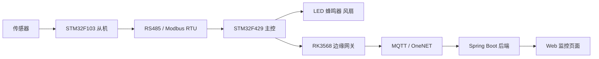

# 立项申请书

## 一、项目基本信息

| 项目 | 内容 |
| --- | --- |
| 项目名称 | 基于 Modbus 与 MQTT 的机柜多源状态监测与远程运维系统 |
| 申请人 | 刘磊、余新洁 |
| 项目类型 | 嵌入式物联网综合实践项目 |
| 建设周期 | 课程实践周期内完成原型设计、开发、联调与文档整理 |
| 核心硬件 | STM32F429、STM32F103、RK3568、RS485 模块、光敏电阻、DHT11、MQ-2、LED、蜂鸣器、风扇 |
| 核心软件 | Keil、标准外设库、Modbus RTU、MQTT、OneNET、Spring Boot 3 |

## 二、立项背景

随着校园网络、企业信息化和社区弱电系统的普及，小型机房、网络机柜和弱电间中部署的交换机、路由器、网关、电源模块等设备越来越多。这些设备虽然规模不大，但通常承担网络连接、数据转发和基础业务支撑功能，一旦出现温度过高、烟雾异常、设备断电或机柜异常开启等问题，可能造成网络中断、设备损坏，甚至引发安全事故。

传统机柜管理方式主要依赖人工巡检。巡检人员需要定期到现场查看设备状态、温湿度情况和电源运行情况，这种方式存在明显不足：一是巡检周期固定，无法实时发现突发异常；二是状态记录不连续，不利于后续分析和追溯；三是多个机柜分散部署时，人工维护成本较高；四是夜间、假期等特殊时段容易出现管理空档。

因此，有必要设计一套面向小型机柜的多源状态监测与远程运维系统。该系统通过传感器采集机柜内部环境数据，通过 STM32 主控完成本地判断和告警联动，通过 RK3568 边缘网关与 MQTT 协议实现数据上云，再由后端服务和 Web 页面提供远程查看能力。项目既能解决机柜运维中的实际问题，也能综合运用嵌入式开发、总线通信、物联网云平台和后端服务等课程知识，具有较强的实践价值。

## 三、市场与应用分析

### 3.1 应用场景分析

本项目主要面向小型化、低成本、易部署的机柜监测场景，适用于校园、实验室、小型企业和社区弱电环境。

| 应用场景 | 现有问题 | 项目价值 |
| --- | --- | --- |
| 校园网络机柜 | 分布范围广，人工巡检效率低 | 实时监测环境状态，降低人工巡检压力 |
| 实验室设备柜 | 设备调试频繁，运行状态变化快 | 便于观察环境变化和设备运行情况 |
| 小型企业机房 | 缺少专业动环监控系统 | 以较低成本获得核心监测能力 |
| 社区弱电间 | 空间封闭，环境变化不易发现 | 及时发现温度、烟雾等安全风险 |

### 3.2 同类产品分析

目前市场上的机房动环监控系统功能较完整，通常支持温湿度、水浸、烟感、门禁、电量、视频监控和告警平台联动。但这类产品往往价格较高，部署流程复杂，对施工、布线和平台配置要求较高，更适合大型机房或专业数据中心。

对于小型机柜、课程实践和轻量化运维场景，完整商用动环系统存在一定资源浪费。本项目采用 STM32 主从控制、RS485/Modbus 通信、RK3568 边缘网关、MQTT 上云和 Spring Boot 展示的方案，能够以较低复杂度完成核心状态监测，并保留后续扩展能力。与单一传感器报警器相比，本项目能够实现多源数据采集、远程查看和系统化管理；与大型商用系统相比，本项目更适合教学实践和小规模应用验证。

### 3.3 市场可行性

从应用需求看，小型机柜和弱电间数量多、分布广，确实存在低成本智能监测需求。从技术供给看，STM32、RK3568、RS485、MQTT 和 Spring Boot 均为成熟技术，硬件和软件资料丰富，开发风险可控。从扩展方向看，项目后续可以增加电压电流检测、门磁开关、继电器控制、历史数据存储和报警推送，具备继续完善为小型动环监控系统的空间。

## 四、项目目标

本项目拟建设一套“本地可独立告警、远程可查看状态、后续可扩展运维”的机柜多源状态监测系统。具体目标如下：

1. 完成光照、温度、湿度和烟雾浓度等机柜环境数据采集。
2. 完成 STM32F429 主控与多个 STM32F103 从机之间的 RS485/Modbus RTU 通信。
3. 完成主控侧数据汇聚、阈值判断和本地告警控制。
4. 完成 LED、蜂鸣器和风扇等执行器联动。
5. 完成 RK3568 边缘网关的数据接收、MQTT 封装和 OneNET 上云传输。
6. 完成 Spring Boot 后端基础服务，实现设备状态缓存、接口查询和页面展示。
7. 预留电压、电流、门磁、继电器、历史记录和远程控制等扩展接口。

## 五、项目范围

### 5.1 本期建设范围

本期项目重点完成原型系统的核心闭环，包括感知采集、主从通信、本地告警、网关上云和状态展示。

| 模块 | 建设内容 |
| --- | --- |
| 传感器采集 | 光敏电阻采集光照，DHT11 采集温湿度，MQ-2 采集烟雾浓度 |
| 从机节点 | 三个 STM32F103 从机分别负责不同传感器数据采集 |
| 主控节点 | STM32F429 负责 Modbus 轮询、数据缓存、告警判断和执行器控制 |
| 通信链路 | RS485/Modbus RTU 完成主从通信，RK3568/MQTT 完成上云传输 |
| 本地告警 | 根据阈值控制 LED、蜂鸣器和风扇 |
| 后端展示 | Spring Boot 提供状态接口和基础 Web 监控页面 |

### 5.2 后续扩展范围

以下内容作为后续优化方向，不作为本期必须完成的核心目标：

1. 接入电流互感器和电压检测模块，实现供电状态监测。
2. 接入门磁开关，实现机柜开关门状态识别。
3. 接入继电器模块，实现远程电源控制或异常断电保护。
4. 增加 MySQL、Redis 等持久化能力，保存历史曲线和报警记录。
5. 增加短信、邮件或企业微信等告警推送方式。
6. 完善 RK3568 边缘网关的数据缓存、断点续传和多协议转换能力。

## 六、技术分析

### 6.1 总体技术路线

系统采用“从机采集、主控汇聚、本地联动、边缘网关上云、后端展示”的技术路线。

### 6.2 硬件技术分析

| 硬件 | 作用 | 选型理由 |
| --- | --- | --- |
| STM32F429 | 主控核心 | 外设资源丰富，适合承担主站轮询、控制和数据汇聚 |
| STM32F103 | 从机节点 | 成本低、资料多，适合单传感器采集节点 |
| RK3568 | 边缘网关 | 具备 Linux 运行环境和更强算力，便于 MQTT、缓存和协议转换 |
| RS485 模块 | 总线通信 | 适合多节点、较远距离和抗干扰通信 |
| 光敏电阻 | 光照采集 | 电路简单，便于判断机柜内部光照变化 |
| DHT11 | 温湿度采集 | 使用方便，适合课程项目环境监测 |
| MQ-2 | 烟雾采集 | 可用于烟雾或可燃气体异常检测 |

### 6.3 软件技术分析

| 技术 | 作用 | 可行性说明 |
| --- | --- | --- |
| 标准外设库 | STM32 外设开发 | 与现有 Keil 工程匹配，适合裸机开发 |
| Modbus RTU | 主从通信协议 | 协议成熟，帧格式清晰，适合 RS485 总线 |
| MQTT | 云端消息传输 | 轻量、可靠，适合物联网设备数据上报 |
| OneNET | 物联网云平台 | 支持设备接入和消息流转，便于项目演示 |
| Spring Boot 3 | 后端服务 | 便于快速开发 REST API、状态缓存和页面展示 |
| Web 页面 | 远程查看 | 用户可通过浏览器查看设备状态 |

### 6.4 关键技术问题

1. 多从机通信稳定性：需要统一从机地址、寄存器映射、波特率和 CRC 校验方式。
2. 传感器数据有效性：需要对异常值进行过滤，避免误触发告警。
3. 本地告警实时性：主控需要在网络异常时仍能独立完成告警判断。
4. RK3568 数据转发可靠性：网关需要完成主控数据解析、MQTT 连接管理和断线重连。
5. 后端字段一致性：主控、网关、云端和后端之间应统一温度、湿度、光照、烟雾和告警字段。

### 6.5 风险与应对措施

| 风险 | 影响 | 应对措施 |
| --- | --- | --- |
| RS485 通信异常 | 主控无法获取从机数据 | 增加 CRC 校验、超时处理和单节点测试 |
| 传感器采样波动 | 告警状态误判 | 增加阈值范围判断和简单滤波 |
| RK3568 网关异常 | 数据无法上传云端 | 本地告警不依赖云端，网关支持重连和日志记录 |
| MQTT 连接不稳定 | 页面数据更新延迟 | 增加心跳检测和断线重连 |
| 联调时间不足 | 影响最终展示 | 按模块先单独验证，再逐步集成 |

## 七、预期成果

项目完成后预期形成以下成果：

1. 一套可运行的机柜多源状态监测原型系统。
2. 三个 STM32F103 传感器从机工程。
3. 一个 STM32F429 主控工程。
4. 一套 RK3568/MQTT 上云传输方案。
5. 一个 Spring Boot 后端服务和基础监控页面。
6. 项目需求、详细设计、立项申请、测试计划等配套文档。

## 八、项目进度安排

| 阶段 | 工作内容 | 阶段成果 |
| --- | --- | --- |
| 第 1 阶段 | 项目选题、背景调研、需求分析 | 明确项目目标和范围 |
| 第 2 阶段 | 硬件选型、系统架构和通信协议设计 | 完成总体方案 |
| 第 3 阶段 | 光照、温湿度、烟雾从机开发 | 完成传感器采集 |
| 第 4 阶段 | STM32F429 主控轮询和本地告警开发 | 完成本地控制闭环 |
| 第 5 阶段 | RK3568 网关和 MQTT 上云联调 | 完成云端数据上传 |
| 第 6 阶段 | Spring Boot 后端和页面展示 | 完成远程状态查看 |
| 第 7 阶段 | 系统测试、问题修复和文档整理 | 完成项目交付 |

## 九、人员分工

| 人员 | 主要任务 |
| --- | --- |
| 刘磊 | 负责 STM32 主控、从机采集、RS485/Modbus 通信、本地告警、RK3568 网关联调和硬件测试 |
| 余新洁 | 负责项目调研、需求分析、后端服务、Web 展示、测试记录、文档整理和演示材料 |
| 共同完成 | 系统联调、问题排查、最终验收和答辩准备 |

## 十、立项结论

本项目面向小型机柜和弱电间的环境安全监测需求，具有明确的应用背景和实际意义。方案采用 STM32 主从采集、RS485/Modbus 通信、RK3568 边缘网关、MQTT 上云和 Spring Boot 展示，技术路线清晰，软硬件资源可获得，开发难度适中，适合作为嵌入式物联网综合实践项目。

项目完成后能够实现机柜环境状态实时采集、本地告警和远程查看，为后续扩展电源监测、门禁监测、历史数据分析和远程运维控制提供基础。因此，本项目具备立项必要性和可行性，建议批准立项。
