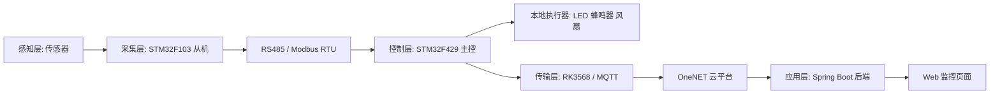
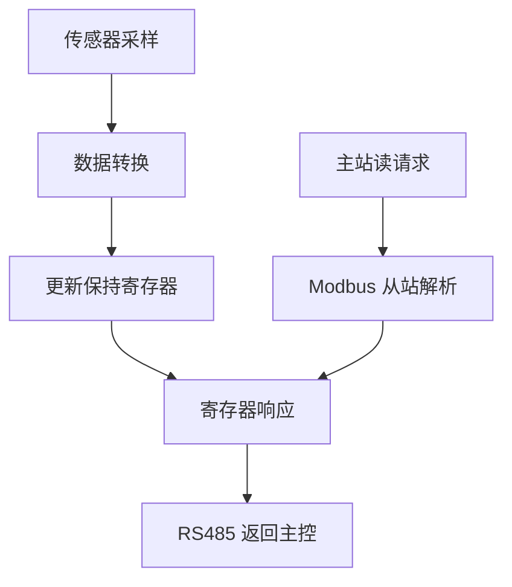

# 项目详细设计-含分工计划

## 一、项目概述

本项目为“基于 Modbus 与 MQTT 的机柜多源状态监测与远程运维系统”。系统通过多个 STM32F103 从机采集光照、温湿度和烟雾数据，由 STM32F429 主控通过 RS485/Modbus RTU 进行统一轮询，并在本地完成告警判断、蜂鸣器提示、LED 指示和风扇联动。联网部分通过 RK3568 边缘网关与 MQTT 进行上云传输，后端采用 Spring Boot 实现状态接收、缓存、接口输出和页面展示。电压电流、门磁、继电器等功能作为后续扩展方向预留。

开发人员：刘磊、余新洁。

## 二、总体架构设计

系统采用分层架构，分为感知层、采集层、控制层、传输层和应用层。



### 2.1 感知层

感知层负责采集机柜环境状态，包括：

| 传感器 | 采集内容 | 说明 |
| --- | --- | --- |
| 光敏电阻 | 机柜内部光照 | 可辅助判断机柜是否被打开或环境变化 |
| DHT11 | 温度、湿度 | 反映机柜散热和环境状态 |
| MQ-2 | 烟雾/可燃气体 | 用于发现烟雾、气体异常等安全风险 |

### 2.2 采集层

采集层由三个 STM32F103C8T6 从机组成。每个从机职责单一，便于单独调试和替换。

| 从机地址 | 工程目录 | 采集对象 | 寄存器 |
| --- | --- | --- | --- |
| `0x01` | `09-2-F103-photoresistor` | 光照 | `40001` |
| `0x02` | `09-3-F103-DHT11` | 温度、湿度 | `40011`、`40012` |
| `0x03` | `09-4-F103-MQ2` | 烟雾浓度 | `40021` |

### 2.3 控制层

控制层由 STM32F429 主控实现，主要职责如下：

1. 初始化串口、RS485、PWM、蜂鸣器、LED、风扇和 MQTT 模块。
2. 周期性轮询各个从机的 Modbus 寄存器。
3. 对采集数据进行有效性判断和缓存。
4. 根据阈值计算告警等级。
5. 根据告警等级执行本地声光报警和风扇控制。
6. 将数据交给联网模块进行 MQTT 上传。

### 2.4 传输层

传输层当前以 RK3568 边缘网关为主要联网方案，用于完成 MQTT 上云和数据转发。主控通过串口或以太网与 RK3568 通信，RK3568 对主控上传的数据进行解析、封装和缓存，并将数据发布到 OneNET。该方案便于后续扩展本地数据缓存、协议转换、日志记录和边缘计算能力。

### 2.5 应用层

应用层采用 Spring Boot 3，实现以下能力：

1. 接收或消费 OneNET 侧设备消息。
2. 解析温度、湿度、光照、烟雾和设备状态字段。
3. 缓存最新设备状态。
4. 提供 REST API 给页面查询。
5. 提供基础登录和设备控制接口，为后续远程运维扩展做准备。

## 三、模块详细设计

### 3.1 主控主流程模块

主控主流程位于 `09-1-MQTT-Modbus/User/main.c`。程序启动后完成基础外设初始化，然后进入循环任务。

主流程设计如下：

```text
系统启动
初始化时钟、串口、PWM、SysTick
初始化 Modbus 主站
初始化报警模块和执行器
初始化 RK3568 网关通信与 MQTT 连接

while (1):
    轮询光照从机
    轮询温湿度从机
    轮询烟雾从机
    更新应用数据缓存
    执行告警判断
    控制 LED、蜂鸣器和风扇
    周期性上报 MQTT 数据
```

### 3.2 Modbus 主站通信模块

主站模块负责对从机发送读寄存器请求并解析响应。其设计重点是统一从机地址、寄存器地址和数据长度。

| 轮询对象 | 请求内容 | 返回内容 |
| --- | --- | --- |
| 从机 `0x01` | 读取光照寄存器 | 光照值 |
| 从机 `0x02` | 读取温湿度寄存器 | 温度值、湿度值 |
| 从机 `0x03` | 读取烟雾寄存器 | 烟雾浓度值 |

通信模块需要完成 CRC 校验、超时处理和异常数据过滤，保证业务逻辑使用的数据尽量可靠。

### 3.3 从机采集模块

从机统一采用“传感器驱动 + 数据寄存器 + Modbus 从站协议”的结构。



各从机模块说明：

| 模块 | 主要文件 | 设计说明 |
| --- | --- | --- |
| 光照采集 | `photoresistor/bsp_photoresistor.*` | 通过 ADC 采集光敏电阻模拟量并转换为光照数据 |
| 温湿度采集 | `dht11/bsp_dht11.*` | 通过单总线时序读取 DHT11 温湿度 |
| 烟雾采集 | `mq2/bsp_mq2.*` | 通过 ADC 读取 MQ-2 输出并得到烟雾浓度相对值 |
| 从站协议 | `modbus_slave/*` | 响应主控读取请求并返回寄存器数据 |

### 3.4 告警控制模块

告警模块根据采集数据判断系统状态，分为正常、运行警报和严重警报三个等级。

| 告警等级 | 触发条件 | 执行动作 |
| --- | --- | --- |
| 正常 | 所有参数处于阈值范围内 | 绿灯亮，蜂鸣器关闭，风扇按需低速或停止 |
| 运行警报 | 任一参数超过普通阈值 | 黄灯亮，蜂鸣器间歇鸣叫，风扇中速运行 |
| 严重警报 | 两个及以上参数异常或烟雾严重超限 | 红灯亮，蜂鸣器持续鸣叫，风扇高速运行 |

温度联动设计：

| 温度范围 | 风扇状态 |
| --- | --- |
| `T <= 27℃` | 停止或低速 |
| `27℃ < T <= 35℃` | 中速运行 |
| `T > 35℃` | 高速运行 |

### 3.5 MQTT 上云模块

MQTT 模块负责将主控聚合后的数据上传到云端。上报数据建议包含以下字段：

| 字段 | 含义 |
| --- | --- |
| `temperature` | 温度 |
| `humidity` | 湿度 |
| `light` | 光照 |
| `mq2` | 烟雾浓度 |
| `alarmLevel` | 告警等级 |
| `fanState` | 风扇状态 |
| `deviceOnline` | 设备在线状态 |

该模块需要支持 RK3568 网络初始化、MQTT 连接、数据发布、断线重连和下行消息解析。主控侧负责向 RK3568 输出采集数据，RK3568 侧负责完成 MQTT 客户端连接、消息封装、上报和下行命令转发。

### 3.6 后端服务模块

后端工程位于 `09-5-WebServer/iot-onenet`，模块划分如下：

| 包名 | 职责 |
| --- | --- |
| `config` | 后端配置、安全配置、JSON 配置、OneNET 参数配置 |
| `auth` | OneNET 消息鉴权和消息结构定义 |
| `consumer` | 云端消息消费和处理入口 |
| `services` | 设备状态缓存、设备集成、操作登记 |
| `controller` | 登录接口和设备状态接口 |
| `dto` | 请求和响应数据对象 |

后端接口设计建议：

| 接口 | 方法 | 功能 |
| --- | --- | --- |
| `/api/login` | POST | 用户登录 |
| `/api/status` | GET | 查询最新设备状态 |
| `/api/device/led` | POST | 下发 LED 或执行器控制命令 |
| `/api/device/alarm` | GET | 查询当前告警状态 |

## 四、数据结构设计

### 4.1 主控数据缓存

主控侧建议维护统一数据结构，便于告警判断和 MQTT 上报。

| 数据项 | 类型 | 说明 |
| --- | --- | --- |
| `light` | 整型 | 光照强度或 ADC 转换值 |
| `temperature` | 整型 | 温度值 |
| `humidity` | 整型 | 湿度值 |
| `mq2` | 整型 | 烟雾浓度相对值 |
| `alarmLevel` | 整型 | 告警等级 |
| `fanState` | 整型 | 风扇状态 |
| `lastUpdate` | 时间戳/计数 | 最近更新时间 |

### 4.2 后端状态对象

后端状态对象用于页面展示和接口返回，应与主控上报字段保持一致。

| 字段 | 示例 | 说明 |
| --- | --- | --- |
| `temperature` | `28` | 当前温度 |
| `humidity` | `55` | 当前湿度 |
| `light` | `320` | 当前光照 |
| `mq2` | `18` | 当前烟雾值 |
| `alarmLevel` | `1` | 当前告警等级 |
| `online` | `true` | 设备在线状态 |

## 五、接口设计

### 5.1 Modbus 寄存器接口

| 设备 | 地址 | 寄存器 | 数据 |
| --- | --- | --- | --- |
| 光照从机 | `0x01` | `40001` | 光照 |
| 温湿度从机 | `0x02` | `40011` | 温度 |
| 温湿度从机 | `0x02` | `40012` | 湿度 |
| 烟雾从机 | `0x03` | `40021` | MQ-2 |

### 5.2 MQTT 数据接口

MQTT 上报主题和数据格式应保持稳定，便于后端解析。示例数据如下：

```json
{
  "temperature": 28,
  "humidity": 55,
  "light": 320,
  "mq2": 18,
  "alarmLevel": 1,
  "fanState": 1
}
```

### 5.3 Web API 接口

Web API 返回 JSON 格式，页面根据返回结果刷新监控数据。后端应对异常情况返回明确错误码和提示信息，避免页面无法判断设备离线或数据异常。

## 六、人员分工计划

开发人员为刘磊和余新洁，按照嵌入式、后端、文档和测试工作进行交叉分工。

| 阶段 | 任务 | 负责人 | 协作人 | 交付物 |
| --- | --- | --- | --- | --- |
| 需求分析 | 场景调研、需求整理、功能范围确定 | 余新洁 | 刘磊 | 需求分析文档 |
| 总体设计 | 系统架构、模块划分、通信方案设计 | 刘磊 | 余新洁 | 架构图、模块设计 |
| 从机开发 | 光照、温湿度、烟雾采集节点开发 | 刘磊 | 余新洁 | STM32F103 从机工程 |
| 主控开发 | Modbus 主站、数据缓存、告警联动 | 刘磊 | 余新洁 | STM32F429 主控工程 |
| 上云联调 | RK3568、MQTT、OneNET 数据上传 | 刘磊 | 余新洁 | MQTT 上报功能 |
| 后端开发 | Spring Boot 接口、状态缓存、页面展示 | 余新洁 | 刘磊 | 后端服务与监控页面 |
| 测试验证 | 单元测试、联调测试、异常测试 | 余新洁 | 刘磊 | 测试记录 |
| 文档整理 | 项目说明、详细设计、分工计划、测试计划 | 余新洁 | 刘磊 | 项目文档 |

## 七、进度安排

| 时间阶段 | 工作内容 | 输出结果 |
| --- | --- | --- |
| 第 1 阶段 | 项目选题、背景调研、需求分析 | 确定项目目标和范围 |
| 第 2 阶段 | 硬件选型、系统架构设计、通信协议设计 | 完成总体方案和模块划分 |
| 第 3 阶段 | 三个 STM32F103 从机采集程序开发 | 完成传感器数据采集 |
| 第 4 阶段 | STM32F429 主控轮询、告警和风扇控制 | 完成本地控制闭环 |
| 第 5 阶段 | RK3568/MQTT 上云和 OneNET 联调 | 完成数据上传验证 |
| 第 6 阶段 | Spring Boot 后端和页面展示 | 完成状态查询与展示 |
| 第 7 阶段 | 系统联调、测试、问题修复 | 形成可演示系统 |
| 第 8 阶段 | 文档完善、答辩材料整理 | 完成交付材料 |

## 八、分工合理性说明

刘磊主要负责嵌入式主控、从机通信和硬件联调部分，因为这些任务对 STM32 外设、Modbus 协议和现场调试要求较高。余新洁主要负责需求分析、后端服务、页面展示、测试记录和文档整理，因为这些任务更强调业务梳理、接口设计、结果验证和材料完整性。两人同时参与联调和测试，能够减少软硬件接口理解偏差，提高最终系统的一致性。

该分工既保证了核心代码有人负责，也保证了文档、测试和展示环节有人持续跟进，符合两人小组项目的实际情况。

## 九、本章小结

本章从总体架构、硬件结构、软件模块、数据接口、人员分工和进度安排等方面完成了详细设计。系统采用清晰的分层结构，将采集、通信、控制、上云和展示拆分为相对独立的模块，便于开发、调试和扩展。人员分工覆盖需求、开发、测试和文档，任务分配完整、职责明确、进度安排合理，能够支撑项目按计划完成。
